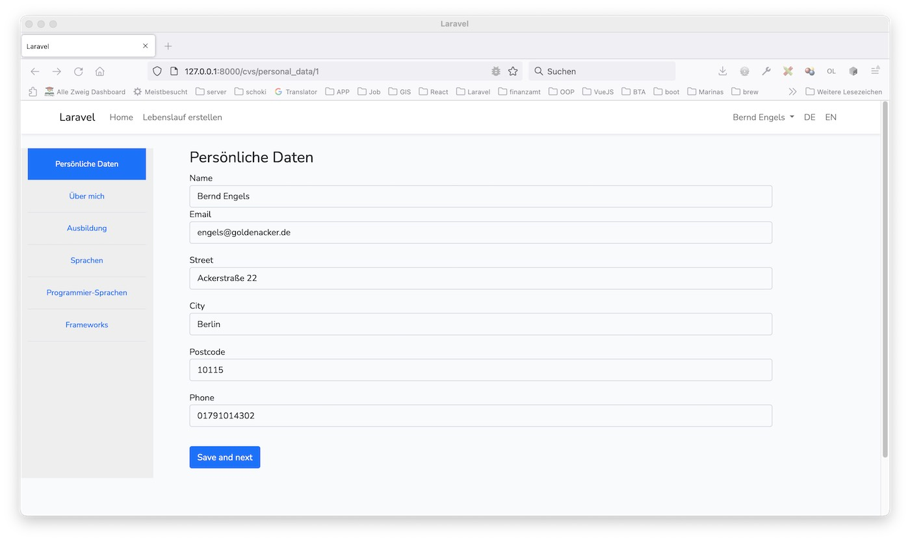
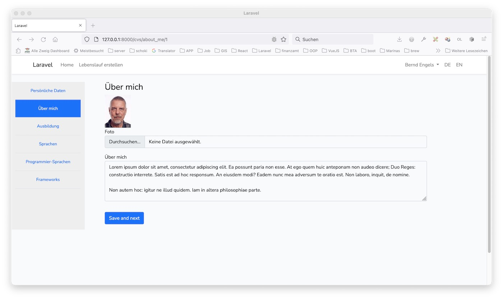
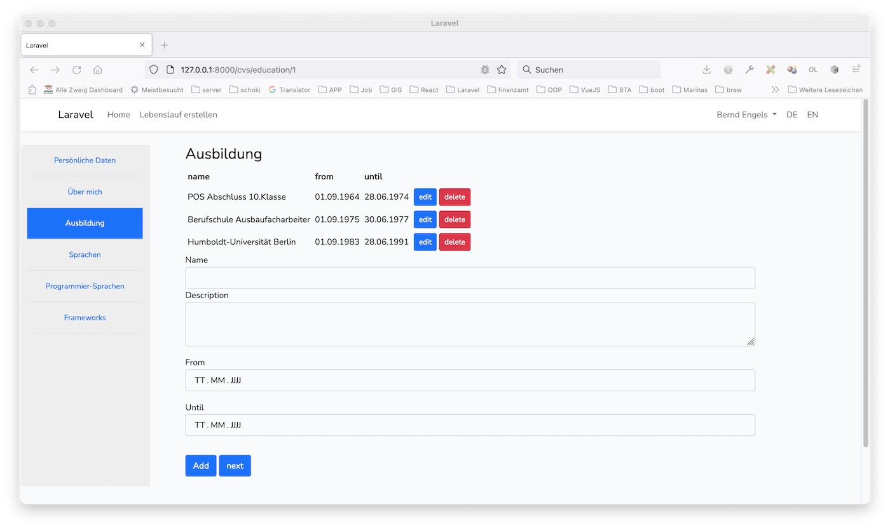
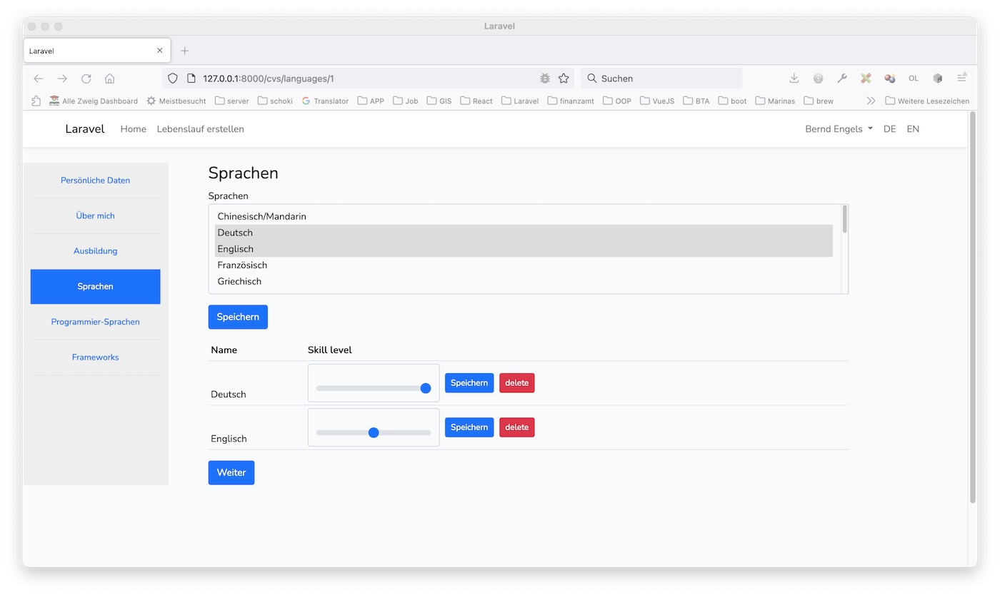
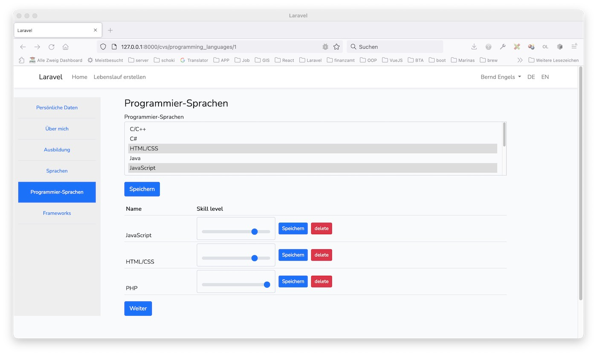
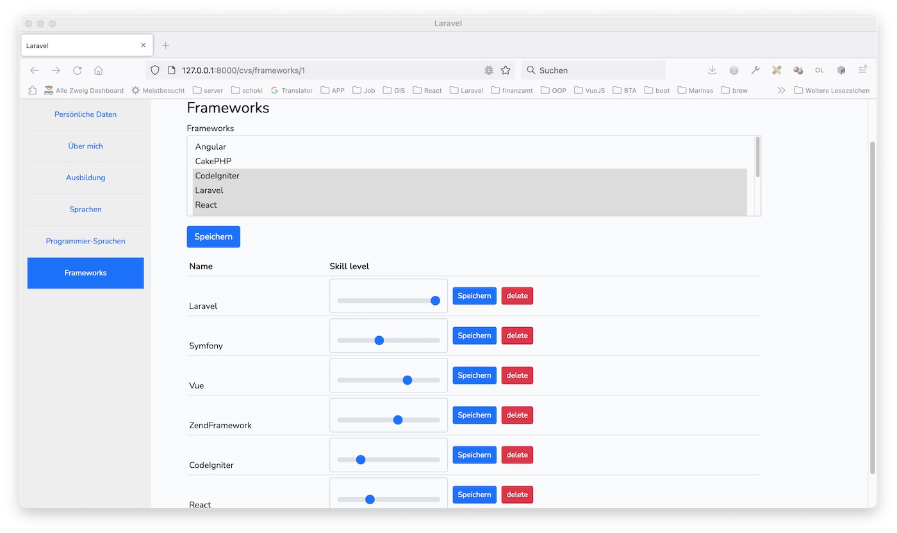

# Pflichtenheft

## Menu
### linkes Menu:
- Home
- Lebenslauf erstellen

### rechtes Menu:
- Login
- Register

### Nach der Registrierung:
#### rechtes Menu:
    - Logout
    - Mein Profil

## Unterseiten

### Unterseite "Lebenslauf erstellen":
- Mein Lebenslauf
	- Foto/persönliche Daten
	- About me
	- Schule/Universität
	- Berufserfahrung
	- Ehrenamtliche Tätigkeiten
	- Projekte
	- Programmiersprachen (Codewars/Github) (Balken, Logos)
	- Sprachen (Balken)
	- (Soft Skills)
	- Kenntnisse (Balken)
	- Interessen/Hobbies

### Unterseite "Mein Profil":
- Mein Account
- Mein Lebenslauf
   - persönliche Daten
   - Foto, About me
   - Schule/Universität
   - Berufserfahrung
   - Ehrenamtliche Tätigkeiten
   - Projekte (Codewars/Github)
   - Dokumentenupload
   - Sprachen (Balken)
   - Programmiersprachen (Balken, Logos)
   - Frameworks
   - Soft Skills
   - Kenntnisse (Balken)
   - Interessen/Hobbies

#### Localisation (de, en ...)
- locale controller, route
- locale middleware

#### Test
- UnitTest
- Dusk Test

## Database
### Tabellen:
- [x] users
  - [ ] customers
    - id 
    - name VARCHAR 50
    - birthdate DATE NULLABLE
    - street VARCHAR 50
    - city VARCHAR 50
    - postcode VARCHAR 10
    - about_me TEXT NULLABLE
    - img VARCHAR 50
    - phone VARCHAR 50
    - email VARCHAR 50
    - password VARCHAR 255
    - remember_token VARCHAR 100 NULLABLE
    - confirmed BOOL DEFAULT 0
    - created_at TIMESTAMP NULLABLE
    - updated_at TIMESTAMP NULLABLE
- [ ] cvs (id, customer_id, link VARCHAR 100)
- [x] programming_languages (id, customer_id, name VARCHAR 50)
- [ ] customer_programming_languages (id, customer_id, programming_language_id, level)
- [x] frameworks (id, name VARCHAR 50)
- [ ] customer_frameworks (id, customer_id, framework_id, level)
- [ ] education (id, customer_id, name VARCHAR 50, description TEXT NULLABLE, from DATE, until DATE)
- [ ] working_experience (id, customer_id, name VARCHAR 50, description TEXT NULLABLE, from DATE, until DATE)
- [ ] voluntary_work (id, customer_id, name VARCHAR 50, description TEXT NULLABLE, from DATE, until DATE)
- [ ] projects (id, customer_id, name VARCHAR 50, description TEXT NULLABLE, from DATE, until DATE)
- [ ] customer_documents (id, customer_id, filename VARCHAR 50, type VARCHAR 10)
- [x] languages (id, name VARCHAR 50)
- [ ] customer_languages (id, customer_id, language_id, level)
- [ ] soft_skills (id, customer_id, name VARCHAR, description TEXT NULLABLE)
- [ ] hard_skills (id, customer_id, name VARCHAR, description TEXT NULLABLE)
- [ ] interests (id, customer_id, name VARCHAR, description TEXT NULLABLE)

### persönliche Daten

### Foto, About me

### Schule/Universität

### Sprachen (Balken)

### Programmiersprachen (Balken, Logos?)

### Frameworks (Balken)

